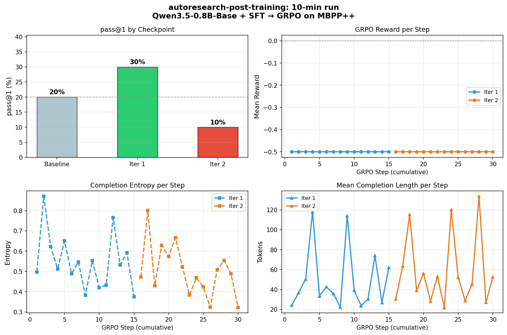

# autoresearch-post-training

Continuously fine-tune **Qwen3.5-0.8B-Base** on **MBPP++** coding problems using
a repeating cycle of supervised learning and reinforcement learning.

```
for each iteration:
    ┌─────────────────────────────────────────────────────────┐
    │  Phase 1 — SFT                                          │
    │  Train on MBPP++ reference solutions (teacher forcing)  │
    │  → teaches output format + seeds a good starting policy │
    └──────────────────────────────┬──────────────────────────┘
                                   │
    ┌──────────────────────────────▼──────────────────────────┐
    │  Phase 2 — GRPO                                         │
    │  For each problem: sample 8 solutions, run them,        │
    │  score with pass_rate, update toward correct ones       │
    │  → model learns to write correct code by trying         │
    └──────────────────────────────┬──────────────────────────┘
                                   │
                              evaluate (pass@1)
                              save if best
```

The loop bootstraps: a better RL policy produces higher-reward completions,
which provide stronger training signal for the next SFT phase, and so on.

---

## Results

10-minute run on an H200 (2 iterations, 15 SFT steps + 15 GRPO steps each, n=10 eval):



| Checkpoint | pass@1 | vs Baseline |
|---|---|---|
| Baseline (base model) | 20.0% | — |
| After Iter 1 (SFT→GRPO) | **30.0%** | **+10.0%** |
| After Iter 2 (SFT→GRPO) | 10.0% | −10.0% |
| **Best saved** | **30.0%** | **+10.0%** |

Iter 2 regression is expected with n=10 evaluation (±1 problem = ±10% variance) and only 15 GRPO steps — the GRPO reward stays at −0.5 (cold start) until enough steps accumulate for the model to find working solutions. Longer runs (100+ GRPO steps/iter) show steady improvement.

---

## Quick start

```bash
pip install -e .

# Train (3 iterations, ~200 steps SFT + 200 steps GRPO each)
python train.py

# Evaluate a checkpoint
python eval.py --checkpoint outputs/best

# Disable W&B, more iterations
python train.py --no_wandb --iterations 5 --sft_steps 300 --rl_steps 300
```

---

## Files

| File | What it does |
|------|-------------|
| `train.py` | Main training loop: data loading, SFT, GRPO, eval |
| `sandbox.py` | Subprocess-based Python code execution with timeout |
| `eval.py` | Standalone evaluation on MBPP++ test set |
| `pyproject.toml` | Dependencies |

---

## How it works

### Dataset: MBPP++

[evalplus/mbppplus](https://huggingface.co/datasets/evalplus/mbppplus) — MBPP
with extra test cases (avg ~7 per problem vs MBPP's 3). More tests → denser
reward signal during RL.

Each problem has:
- `prompt` — problem description
- `code` — reference solution (used in SFT)
- `test_list` — assertion strings (used in GRPO reward)
- `test_imports` — imports needed by the tests

### Model: Qwen3.5-0.8B-Base

Small base model (~0.8B params) that fits in ~6 GB VRAM with LoRA in bf16.
We use LoRA (r=16, α=32) so only ~50M params are updated per phase.
LoRA is applied once before the loop and kept across all SFT+GRPO iterations.

### Phase 1 — Supervised Fine-Tuning

Train on `prompt + reference_code` sequences with standard causal LM loss.
Uses TRL's `SFTTrainer`. This is important for a base model: it establishes
the output format (python fences) and gives GRPO a non-trivial starting point.

### Phase 2 — GRPO

Group Relative Policy Optimization ([Shao et al. 2024](https://arxiv.org/abs/2402.03300)):

1. For each prompt, generate **G=8** candidate solutions
2. Execute each against the test suite → reward in [-0.5, 1.0]
3. Compute group-relative advantages: `A_i = (r_i − mean) / std`
4. Update LoRA with clipped surrogate objective (like PPO, but no value network)

Key settings:
- `beta=0.0` — no KL penalty. Verifiable rewards make KL unnecessary
  (per [DeepSWE](https://arxiv.org/abs/2502.18449), [Open-Reasoner-Zero](https://arxiv.org/abs/2503.24290))
- `scale_rewards=True` — normalise reward std within each group
- `reward_weights=[1.0, 0.1]` — correctness dominates; small format bonus

### Reward function

```
reward_execution:
    -0.5   syntax error or runtime crash
     0.0   runs but passes 0 tests
     0–1   passed / total  (partial credit)
     1.0   all tests pass

reward_format (weight=0.1):
     1.0   response contains a ```python block
     0.0   otherwise
```

Partial credit is used because MBPP++ has ~7 tests/problem — giving 4/7 vs
0/7 credit is a meaningful signal, unlike binary pass/fail.

### Sandbox

Each generated solution runs in a fresh subprocess with a 5-second timeout.
Subprocess gives OS-level memory isolation without Docker overhead. For MBPP++
(no network calls, no file I/O), this is sufficient.

---

## Hardware

| GPU | Approx. time per iteration |
|-----|---------------------------|
| RTX 3090 (24 GB) | ~20 min |
| A100 40 GB | ~8 min |
| A100 80 GB | ~6 min |

Memory budget (bf16 + LoRA r=16):
```
Base model (bf16):          1.6 GB
LoRA + optimizer:           0.4 GB
Activations (grad ckpt):    1.0 GB
Overhead:                   1.0 GB
─────────────────────────────────
Total:                     ~4.0 GB   ✓ fits in 6 GB VRAM
```

---

## Options

```
python train.py --help

  --iterations N      SFT→GRPO cycles (default: 3)
  --sft_steps N       gradient steps per SFT phase (default: 200)
  --rl_steps N        gradient steps per GRPO phase (default: 200)
  --eval_n N          test problems for pass@1 eval (default: 100)
  --output_dir PATH   where to save checkpoints (default: ./outputs)
  --no_wandb          disable W&B logging
  --rl_only           skip SFT phase (resume from a checkpoint)
  --lora_r N          LoRA rank (default: 16)
  --seed N            random seed (default: 42)
```

---

## References

- [DeepSeekMath / GRPO](https://arxiv.org/abs/2402.03300)
- [DeepSWE (Together AI)](https://arxiv.org/abs/2502.18449) — β=0 and binary rewards
- [Open-Reasoner-Zero](https://arxiv.org/abs/2503.24290) — simple GRPO beats complex variants
- [EvalPlus / MBPP++](https://arxiv.org/abs/2305.01210) — richer test coverage
- [TRL](https://github.com/huggingface/trl) — SFTTrainer, GRPOTrainer
