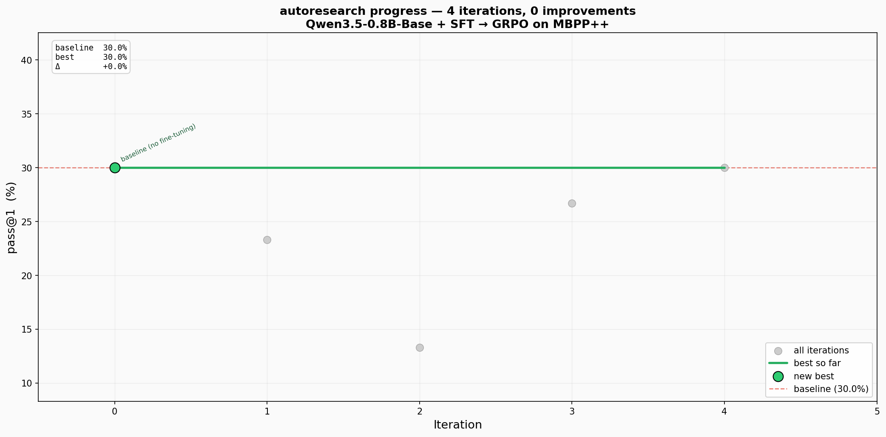

# Run Report

**Date:** 2026-03-15 00:04:29  
**Model:** Qwen3.5-0.8B-Base + LoRA (r=16)  
**Dataset:** evalplus/mbppplus (300 train / 78 eval)  
**Config:** SFT 9steps(lr=5e-05) + GRPO 35steps(lr=5e-06, G=8)  
**Total time:** 29.7 min  

## Results

| Metric | Value |
|--------|-------|
| Baseline pass@1 | 30.0% |
| Best pass@1 | 30.0% (iter 0) |
| Δ vs baseline | +0.0% |
| Iterations run | 4 |
| Total SFT steps | 39 |
| Total GRPO steps | 211 |
| Total time | 29.7 min |

## Progress

## Iteration Log

| Iter | pass@1 | Δ baseline | SFT steps | GRPO steps | New best? |
|------|--------|-----------|-----------|------------|-----------|
| 0 | 30.0% | +0.0% | 0 | 0 | ★ |
| 1 | 23.3% | -6.7% | 9 | 35 |  |
| 2 | 13.3% | -16.7% | 10 | 35 |  |
| 3 | 26.7% | -3.3% | 10 | 69 |  |
| 4 | 30.0% | +0.0% | 10 | 72 |  |

## Analysis

Training did not improve over baseline (30.0%). Performance degraded to a minimum of 13.3% before partially recovering.

**Likely cause:** GRPO reward variance was zero throughout (all completions fail every test case), so group-relative advantages are undefined and no meaningful gradient flows. SFT at high LR overwrites learned behaviour faster than GRPO can recover it.

**Fixes to try:** increase GRPO budget (≥300s), reduce SFT LR (5e-5), or skip SFT (`--rl_only`) after the first iteration.
